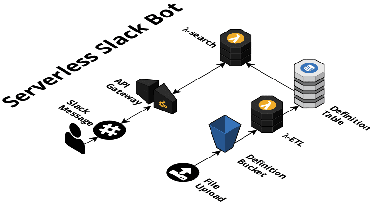

# sls-dictionary-bot

[](https://circleci.com/gh/giusedroid/sls-dictionary-bot)
[](https://coveralls.io/github/giusedroid/sls-dictionary-bot)

## What

This repo provisions a Slack chat bot on AWS.  
It's written in NodeJS with Serverless Framework and a bit of CloudFormation.  

### Architecture



## Configure it

Most of the configuration is provided through environmental variables (both for your CI and local environment).  
A number of manual operations is still needed to get the bot up and running.

### Slack App

### Dictionary

A sample dictionary can be found in `./assets/sampleDictionary.json`.  

```json

[
    {
        "term":"word",
        "definition":"the default action is to create or update. If 'word' is not found, it will be added."
    },
    {
        "term":"word",
        "definition":"if it alreadt exists, this will update the definition of 'word'"
    },
    {
        "term":"word",
        "definition":"this doesn't really matter, as the term will be deleted",
        "action":"delete"
    }
]
```

### Environment

Variables that must be in your (CI) environment to successfully deploy the stacks.  

| Variable Name | Description |
|---------------|-------------|
| AWS_ACCESS_KEY_ID | Your AWS Account Access Key |
| AWS_SECRET_ACCESS_KEY | Your AWS Account Access Secret Key |
| AWS_DEFAULT_REGION | Your Default AWS Region|
| COVERALLS_REPO_TOKEN | (Optional) Your Coveralls repo token to enable coverage history and badge. |
| SLACK_CHALLENGE_TOKEN | The callenge token. You won't have this on your first deploy. Retrieve this in your CloudWatch logs once you have verified your Slack App. More info in [this](http://) section. |
| SLACK_BOT_TOKEN | It's the bot token you get when you register your bot user in Slack App. It begins with `xoxb-` |
| SLACK_TEST_CHANNEL | The id of the channel you want to run tests into. You can find it by right-clicking on the channel name and selecting `Copy Link`. The id is the last element of the path in it. E.g., in `https://my-workspace.slack.com/messages/C01234567`, the id is `C01234567`|

## Run

### CircleCI

You can deploy this via CircleCI by forking this repository, creating a CircleCI account [here](https://circleci.com) and enabling this repository.  
Make sure you configure the job with the provided environmental variables.

### Locally

Install NodeJS 8.10 (use of `nvm` is recommended).  

```bash
nvm use # optional
npm i -g serverless
npm i
npm run test:local # won't ship coverage report to coverall
make deploy-local
make seed-local
```

## Test

### Unit Test

```bash
nvm use
nmp i
npm run test:local # won't ship coverage report to coverall
```

### End 2 End

```bash
nvm use
npm i -g serverless
npm i
# make sure all the environmental variables are set
npm run test:e2e
```